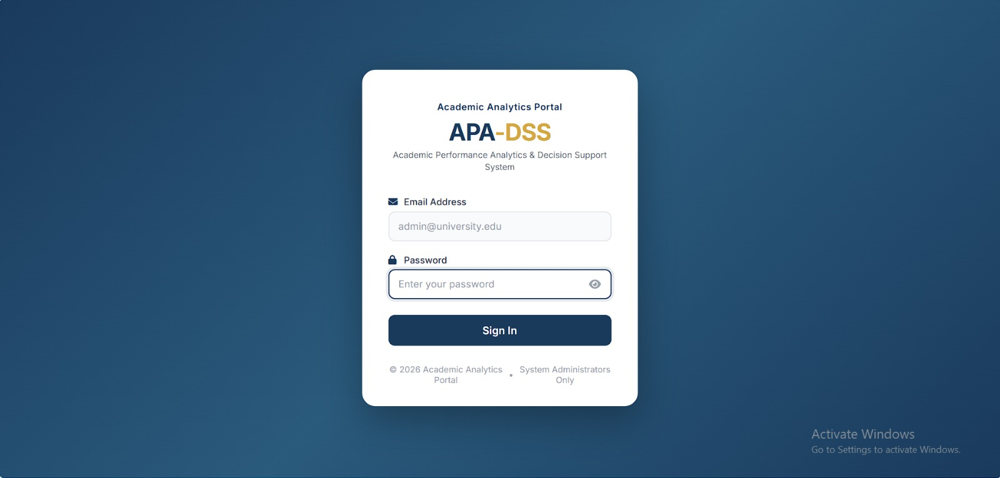
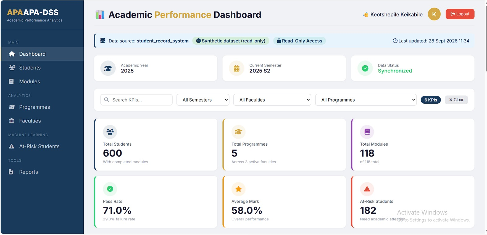
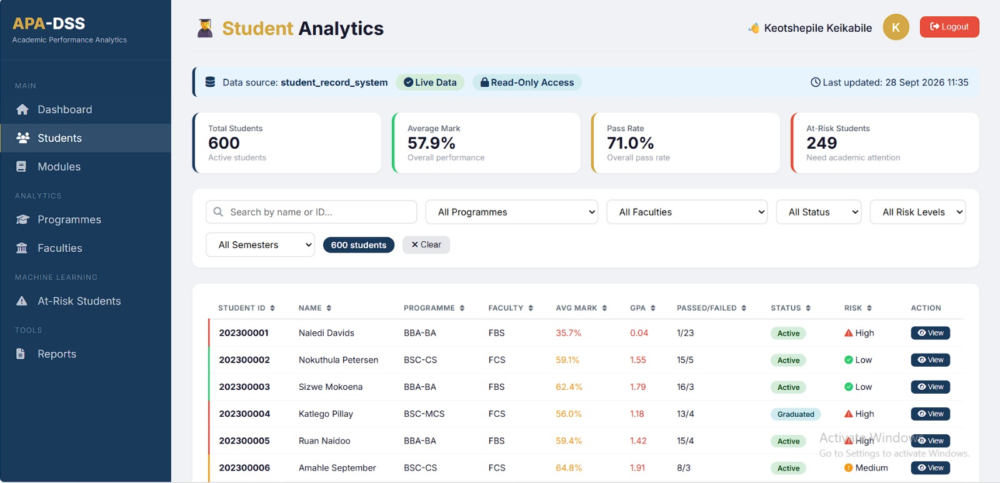
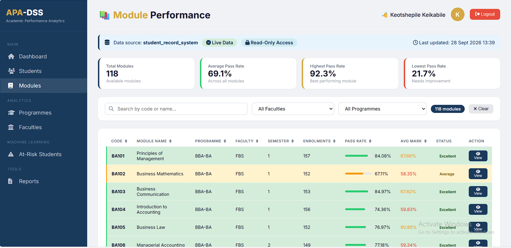
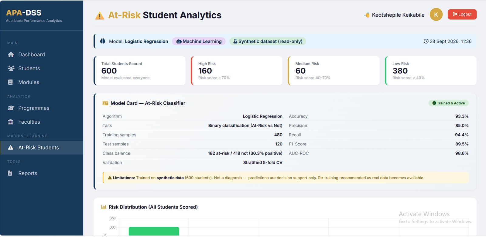
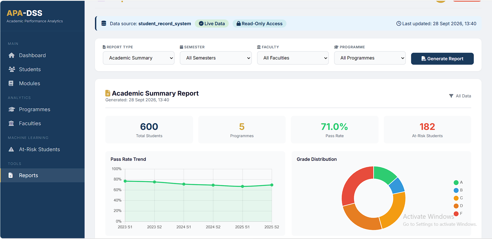
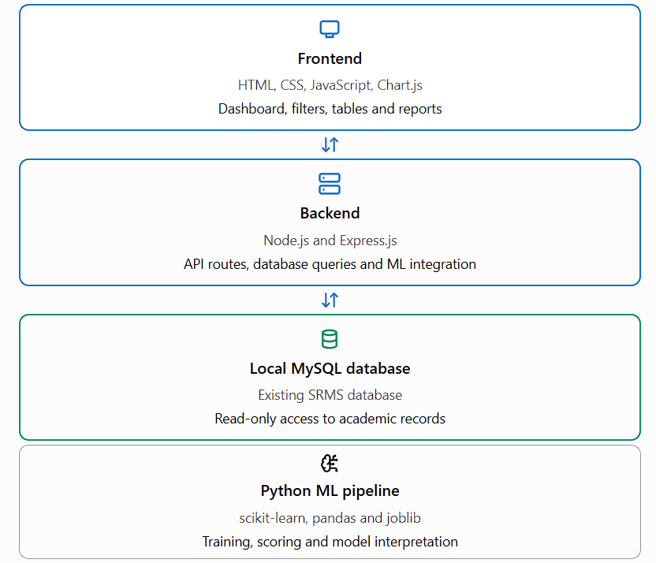

<div align="center">

# 🎓 APA-DSS

### Academic Performance Analytics & Decision Support System

[](https://nodejs.org/)
[](https://expressjs.com/)
[](https://www.mysql.com/)
[](https://www.python.org/)
[](https://scikit-learn.org/)
[](https://www.chartjs.org/)

**A web-based analytics platform that transforms an existing Student Record Management System (SRMS) database into an interactive academic decision-support tool — with interpretable machine learning for early at-risk student identification.**

</div>

---

## 📖 Overview

Educational institutions store large volumes of academic data in student record systems. While these systems excel at **record-keeping**, they rarely provide **insight**:

- Which students are falling behind?
- Which modules consistently have low pass rates?
- Which programmes are struggling?
- Where should academic support be focused?

**APA-DSS** answers these questions. It sits **beside** the existing SMS — never modifying it — and reads academic data in **read-only** mode to generate dashboards, KPIs, trends, and machine-learning-based at-risk predictions.

> **Mini-Capstone Project** — Special Topics in Computer Science
> Demonstrated at the intersection of **Software Engineering**, **Data Analytics**, and **Machine Learning**.

> 📖 **Presentation-friendly project guide:** [`docs/project-guide.html`](docs/project-guide.html) — a self-contained showcase you can open in Chrome during the defence.

---

## 📸 System Walkthrough — Screenshots with Explanations

Each screenshot below is annotated to explain **what it shows** and **why it matters** from an academic decision-support perspective.

---

### 1. Secure Administrator Login



**What this screen shows:**
A branded login page for the APA-DSS interface. Only existing SMS administrators can authenticate — there is no public sign-up. Sessions are managed server-side using `express-session`, with `httpOnly` cookies to prevent client-side script access.

**Why it matters:**
Analytics contain sensitive student information. Restricting access to authenticated administrators enforces the principle of **least privilege** and aligns with POPIA data-protection expectations for educational records.

---

### 2. Main Academic Dashboard



**What this screen shows:**
The primary decision-support view. It aggregates **six headline KPIs** — total students, programmes, modules, overall pass rate, average mark, and at-risk count — and displays:

- **GPA trend by semester** — a line chart showing academic performance over time
- **Academic progression breakdown** — Proceed / Repeat / At-Risk / Excluded
- **Top 5 / Bottom 5 modules** by pass rate — a horizontal bar chart
- **Failure hotspots** — bubble chart highlighting modules with high failure concentrations
- **At-risk alerts by programme** — grouped bar chart

The filters (semester, faculty, programme) allow slicing the entire dashboard dynamically.

**Why it matters:**
This is the **"single pane of glass"** for academic leadership. Within seconds, an academic head can see whether performance is improving or declining, and where intervention is most urgently needed — without writing a single SQL query.

---

### 3. Student-Level Analytics



**What this screen shows:**
A searchable, sortable table of all students with filters for programme, faculty, semester, and year level. Clicking any student opens a **drill-down modal** containing:

- A **colour-coded risk banner** — 🔴 HIGH / 🟠 AT RISK / 🟡 MONITOR / 🟢 ON TRACK
- **Class rank** within the student's programme
- **Marks history chart** across semesters
- **Comparison** against programme and university averages
- **Failed modules list** for targeted remediation

**Why it matters:**
Academic advisors need to move from *"How is the cohort doing?"* to *"Which specific student needs help, and in what?"* This view provides that path in **two clicks**.

---

### 4. Module Performance Deep-Dive



**What this screen shows:**
Selecting any module opens a drill-down modal showing:

- **Rank within its programme** — is this module performing better or worse than its peers?
- **Difficulty index** — a computed measure of failure severity
- **Pass-rate trend** — is the module improving over semesters?
- **Mark distribution histogram** — the spread of student marks
- **Bottom-5 performing students** — a shortlist for module-level intervention

**Why it matters:**
Module coordinators can identify **structurally difficult modules** (high failure every semester) versus **anomalies** (a sudden drop). This distinction drives very different interventions: curriculum redesign versus one-off support.

---

### 5. At-Risk Students — Machine Learning



**What this screen shows:**
The machine-learning decision-support view. Every student in the database is scored by a **Logistic Regression classifier**, and results are presented as:

- **Model Card** — documents algorithm, training size (480), test size (120), and evaluation metrics
- **Risk distribution histogram** — how many students fall into each risk band
- **Per-student top risk factors** — expressed in plain language (e.g., *"Failed 3 of 4 modules in the most recent semester"*)
- **Retrain button** — reruns the full ML pipeline end-to-end from the UI

**Machine Learning metrics (held-out test set):**

| Metric | Value |
|---|---:|
| Accuracy | 93.3% |
| Precision | 85.0% |
| Recall | 94.4% |
| F1-Score | 89.5% |
| AUC-ROC | 98.6% |
| 5-fold CV Accuracy | 91.0% ± 1.7% |

**Why it matters:**
Rather than a black-box prediction, each at-risk flag is **explainable**. An advisor sees *why* the model flagged a student. This preserves academic staff judgement as the final decision-maker — the model is a **decision-support aid**, never an automated verdict.

> ⚠️ **Academic honesty note:** These metrics were produced using **synthetic training data** during development. They validate the correctness of the ML pipeline; they do **not** represent real-world prediction performance on institutional data.

---

### 6. Reports & Export



**What this screen shows:**
A reporting interface offering five pre-built report types:

- Academic Summary
- Module Report
- Programme Report
- Student Report
- At-Risk Report

Each report can be **exported as CSV** for further analysis in Excel, or **printed / saved as PDF** via the browser's native print dialog.

**Why it matters:**
Universities run on documents. Reports must reach committee meetings, external reviewers, and accreditation bodies. Built-in CSV and PDF export turns analytics into **actionable paperwork** without re-keying data.

---

## 🏗 Architecture

APA-DSS follows a **layered, read-only architecture** that integrates with the existing SRMS without modifying it.



> 💡 **Conceptual diagram** — the four-layer stack showing how data flows from the existing SRMS database through the Node.js API to the browser, with the Python ML pipeline invoked via `child_process`.

### Key architectural decisions

| Decision | Reason |
|---|---|
| **Read-only DB user** | Protects the existing SRMS from accidental modification |
| **Separate `apa_dss_user`** | Principle of least privilege — analytics never has write access |
| **Python via `child_process`** | Keeps ML logic in its native ecosystem without a separate microservice |
| **Session-based auth** | Matches existing SMS admin model; no duplicate user store |
| **Chart.js** | Lightweight, no build step, framework-agnostic |

---

## 🤖 Machine Learning Pipeline

### Algorithm: Logistic Regression

Chosen because:

- **Interpretable** — coefficients directly show feature influence
- **Fast** — retrains in seconds, suitable for a live "retrain" button
- **Well-calibrated probabilities** — meaningful risk scores
- **Appropriate for dataset size** — performs well without huge training data

### At-Risk Definition

> A student is **At-Risk** if they failed **≥ 50%** of attempted modules in their most recent completed semester.

Evidence-based, actionable, and avoids data leakage (uses past performance only).

### Top Predictors

| Feature | Coefficient | Direction |
|---------|------------:|-----------|
| `avg_mark_last_sem` | −4.17 | ↓ decreases risk |
| `failure_rate` | +1.83 | ↑ increases risk |
| `avg_mark` | +1.23 | ↑ increases risk |
| `year_level` | +1.12 | ↑ increases risk |
| `num_modules` | −1.07 | ↓ decreases risk |
| `num_failed` | +0.98 | ↑ increases risk |

### ⚠️ Critical Limitation

> **The model was trained on synthetic data.** Metrics demonstrate correct implementation, not real-world prediction quality. Real institutional validation would be required before any deployment.

---

## 🧰 Technology Stack

| Layer | Technology | Purpose |
|-------|-----------|---------|
| **Frontend** | HTML5, CSS3, JavaScript | Core UI |
| | Chart.js 4 | Data visualization |
| | Font Awesome 6 | Icons |
| | Inter (Google Fonts) | Typography |
| **Backend** | Node.js 18+ | Runtime |
| | Express.js 4 | HTTP framework |
| | `mysql2` | MySQL driver (prepared statements) |
| | `express-session` | Session management |
| | `dotenv` | Environment configuration |
| **Database** | MySQL 8.0 | Relational store (read-only) |
| **ML Pipeline** | Python 3.11 | Runtime |
| | pandas, numpy | Data manipulation |
| | scikit-learn 1.3+ | Logistic Regression |
| | joblib | Model serialization |
| **Integration** | Node.js `child_process` | Backend ↔ Python |

---

## 🚀 Setup Instructions

### Prerequisites

- Node.js 18+
- MySQL 8.0+
- Python 3.10+
- Git

### Step 1 — Clone the repository

```bash
git clone https://github.com/Keotshepile2/Academic-Analytics-System.git
cd Academic-Analytics-System
